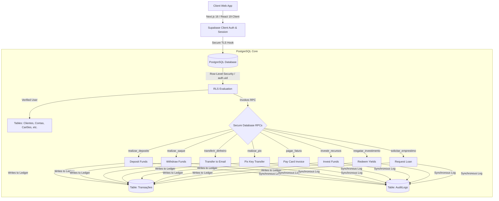

# Thallium Ledger Core

[](https://nextjs.org/)
[](https://tailwindcss.com/)
[](https://www.typescriptlang.org/)
[](https://supabase.com/)
[](https://playwright.dev/)
[](LICENSE)

Thallium is an enterprise-grade digital ledger bank infrastructure designed with clinical precision and high-integrity transactional mechanics. Engineered with Next.js 16 App Router, Tailwind CSS v4, and Supabase (Postgres), Thallium represents a robust double-entry system leveraging strict Row Level Security (RLS) policies and transaction processing executed entirely via secure database RPC functions.

---

## System Architecture

Thallium routes all critical financial transactions through atomic database-level RPC procedures to eliminate race conditions, prevent negative balance anomalies, and ensure audit logs are generated synchronously.



---

## Database Schema & Relations

The schema, defined in `supabase/migrations/20260710000000_create_thallium_tables.sql`, is built for high compliance and performance. It consists of the following key tables and relations:

### 1. clientes
Links authentication credentials directly to user profiles.
*   **id_cliente** `UUID` (Primary Key, references `auth.users` on cascade delete)
*   **nome** `TEXT` (Not Null)
*   **email** `TEXT` (Unique, Not Null)
*   **cpf** `VARCHAR(11)` (Unique, Not Null)
*   **senha_transacao** `TEXT` (Hashed 4-digit PIN for transactions)
*   **created_at** `TIMESTAMP WITH TIME ZONE`

### 2. contas
Tracks balances and accounts types. Auto-increments from `100001` upwards.
*   **numero_conta** `SERIAL` (Primary Key)
*   **id_cliente** `UUID` (References `clientes.id_cliente` on cascade delete)
*   **saldo** `NUMERIC(15,2)` (Defaults to `0.00`, strictly verified `>= 0.00`)
*   **data_abertura** `DATE` (Defaults to current date)
*   **tipo_conta** `TEXT` (Constrained to `'Corrente'`, `'Poupança'`)

### 3. transacoes
The core digital ledger storing debit/credit transactions.
*   **id_transacao** `BIGSERIAL` (Primary Key)
*   **numero_conta** `INT` (References `contas.numero_conta` on cascade delete)
*   **tipo_transacao** `TEXT` (e.g., `'Depósito'`, `'Saque'`, `'Transferência Enviada'`, `'Pix Enviado'`)
*   **valor** `NUMERIC(15,2)` (Signed amounts; negative for debits, positive for credits)
*   **data_transacao** `TIMESTAMP WITH TIME ZONE`
*   **descricao** `TEXT`
*   **categoria** `TEXT` (Defaults to `'Outros'`)

### 4. cartoes
Supports virtual and physical cards with integrated credit limits.
*   **id** `UUID` (Primary Key)
*   **numero** `VARCHAR(16)` (Unique)
*   **validade** `VARCHAR(5)` (MM/YY)
*   **cvv** `VARCHAR(3)`
*   **id_cliente** `UUID` (References `clientes.id_cliente` on cascade delete)
*   **bloqueado** `BOOLEAN` (Defaults to `false`)
*   **limite_total** `NUMERIC(15,2)` (Defaults to `15000.00`)
*   **limite_usado** `NUMERIC(15,2)` (Defaults to `0.00`)
*   **fatura_fechada** `BOOLEAN` (Defaults to `false`)
*   **data_vencimento** `DATE`

### 5. chaves_pix
Handles unique Pix address keys for instant transfers.
*   **id** `UUID` (Primary Key)
*   **tipo** `TEXT` (Constrained to `'cpf'`, `'email'`, `'aleatoria'`)
*   **chave** `TEXT` (Unique)
*   **id_cliente** `UUID` (References `clientes.id_cliente` on cascade delete)

### 6. investimentos
Simulates fixed income assets with interest yield formulas on redemption.
*   **id** `UUID` (Primary Key)
*   **id_cliente** `UUID` (References `clientes.id_cliente` on cascade delete)
*   **tipo** `TEXT` (Constrained to `'CDB'`, `'LCI'`, `'Tesouro'`)
*   **valor_inicial** `NUMERIC(15,2)` (Min `100.00`)
*   **data_aplicacao** `TIMESTAMP WITH TIME ZONE`
*   **taxa_anual** `NUMERIC(5,2)`
*   **resgatado** `BOOLEAN` (Defaults to `false`)

### 7. emprestimos
Tracks capital financing requests.
*   **id_emprestimo** `UUID` (Primary Key)
*   **numero_conta** `INT` (References `contas.numero_conta` on cascade delete)
*   **valor_emprestimo** `NUMERIC(15,2)`
*   **juros** `NUMERIC(5,2)` (Defaults to `5.00%` monthly)
*   **prazo** `INT` (Months)
*   **data_emprestimo** `DATE`
*   **status** `TEXT` (Constrained to `'pendente'`, `'aprovado'`, `'negado'`)

### 8. audit_logs
Automated auditing capturing all ledger mutating events.
*   **id** `BIGSERIAL` (Primary Key)
*   **id_cliente** `UUID` (References `clientes.id_cliente`)
*   **action** `TEXT`
*   **details** `TEXT`
*   **ip_address** `TEXT`
*   **timestamp** `TIMESTAMP WITH TIME ZONE`

---

## Visual Design Principles

Thallium enforces a premium developer-centric visual theme inspired by the chemical element Thallium (Tl, atomic number 81):
-   **Canvas Base:** Absolute black background (`#090909`) with variations (`#121212` and `#1A1A1A`) to define cards, panels, and borders.
-   **Accents:** Metallic details in champagne gold (`#D4AF6A`), deep gold (`#B8893C`), and metallic silver (`#B8BDC7`).
-   **Alerts:** Rose-600 (`#e11d48`) triggers error states, overdraft warnings, and block/cancel operations.
-   **Typography:** Bold rounded display headings via Sora font paired with clean Manrope body copy. Monospace values are enforced for numeric and tabular transactional data.
-   **Curves and Radius:** Soft borders ranging from 16px to 24px (`radius: 1.25rem`) applied to cards, buttons, input fields, and overlays.
-   **Materiality:** Subtle glassmorphic layers (`backdrop-filter`), specular gold sheen gradients, dynamically tilted 3D virtual credit cards, and responsive spring animations.

---

## Local Development Setup

To run Thallium locally, verify you have Yarn and Docker (for local Supabase development) installed.

### 1. Install Dependencies
```bash
yarn install
```

### 2. Configure Environment
Create a copy of `.env.local` based on standard configurations:
```env
NEXT_PUBLIC_SUPABASE_URL=http://localhost:54321
NEXT_PUBLIC_SUPABASE_ANON_KEY=your-supabase-anon-key
```

### 3. Supabase Local Configuration
Initialize Supabase locally and run migrations:
```bash
# Start local Supabase Docker container environment
yarn supabase start

# Apply schema migrations
yarn supabase db reset
```

### 4. Running the Development Server
```bash
yarn dev
```
Open http://localhost:3000 to view your local instance.

---

## Testing Guide

Thallium utilizes a dual-tier testing strategy combining fast unit tests with robust E2E validation.

### Unit and Integration Tests (Vitest)
Unit tests evaluate helper methods, formatters, and client validation utilities in `src/lib/utils.ts` (including CPF validators and PIN hashing).

Run the unit test suite:
```bash
yarn test
```

### End-to-End Tests (Playwright)
E2E flows are located in `src/tests/e2e/bank.spec.ts` and run Chromium browsers to assert core navigation, authentication templates, and signup views.

Run Playwright tests locally:
```bash
yarn test:e2e
```

To run Playwright tests in interactive UI mode:
```bash
yarn playwright test --ui
```

---

## Project Structure

```bash
├── database/            # Database assets and configurations
├── docs/                # Design and architecture documentation
│   ├── DESIGN.md        # UX/UI system guidelines
│   └── AGENTS.md        # Next.js workspace specifications
├── public/              # Static files and assets
├── src/
│   ├── app/             # Next.js 16 App Router pages
│   ├── components/      # UI component library (Button, Modal, Input, etc.)
│   ├── features/        # Complex dashboard sub-views (Ledger, Loans, Cards)
│   ├── hooks/           # Custom React Hooks (useAuth)
│   ├── lib/             # Utilities (utils.ts) and Supabase client config
│   └── tests/           # Vitest and Playwright test files
├── supabase/            # Local Supabase configurations
│   ├── migrations/      # DB SQL schema migrations
│   └── seed.sql         # Local DB seed entries
├── package.json         # Scripts and project configurations
└── playwright.config.ts # Playwright settings
```
